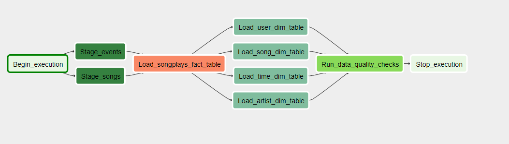

# Data Pipeline with Airflow

## Overview

A music streaming company, Sparkify, has decided that it is time to introduce more automation and monitoring to their data warehouse ETL pipelines and come to the conclusion that the best tool to achieve this is Apache Airflow.

They have decided to bring you into the project and expect you to create high grade data pipelines that are dynamic and built from reusable tasks, can be monitored, and allow easy backfills. They have also noted that the data quality plays a big part when analyses are executed on top the data warehouse and want to run tests against their datasets after the ETL steps have been executed to catch any discrepancies in the datasets.

The source data resides in S3 and needs to be processed in Sparkify's data warehouse in Amazon Redshift. The source datasets consist of JSON logs that tell about user activity in the application and JSON metadata about the songs the users listen to.

## Datasets
For this project, there are two datasets. Here are the s3 links for datasets used in this project:

- `Log data: s3://udacity-dend/log_data`
- `Song data: s3://udacity-dend/song_data`

## Database Schema (Data Warehousing) Design

The schema is already provided for this project. A bit more explanation of the business process:
Since the core business process/metric is an user playing a song, the fact table should store the song play records with user/song identifier together with related information about the how and where the song is played. Based on the data and tables given in the project, the star schema is as follows:

## Structure

Project has two directories named `dags` and `plugins`.

`dags` directory contains:
- `sparkify_dag.py`: Defines main DAG, tasks and link the tasks in required order.

`plugins/operators` directory contains:
- `stage_redshift.py`: Defines `StageToRedshiftOperator` to copy JSON data from S3 to staging tables in the Redshift via `copy` command.
- `load_dimension.py`: Defines `LoadDimensionOperator` to load a dimension table from staging table(s).
- `load_fact.py`: Defines `LoadFactOperator` to load fact table from staging table(s).
- `data_quality.py`: Defines `DataQualityOperator` to run data quality checks on all tables passed as parameter.
- `sql_queries.py`: Contains SQL queries for the ETL pipeline (provided in template).

## Configuration

1. Setup

This code uses `python 3` and assumes that Apache Airflow is installed and configured.

- Run `create_tables.sql` to populate redshift.

- Make sure to add following two Airflow connections:
    - AWS credentials, named `aws_credentials`
    - Connection to Redshift, named `redshift`

2. DAG Configuration

In the DAG, add default parameters according to these guidelines

1. The DAG does not have dependencies on past runs
2. On failure, the task are retried 3 times
3. Retries happen every 5 minutes
4. Catchup is turned off
5. Do not email on retry

In addition, configure the task dependencies so that after the dependencies are set, the graph view follows the flow shown in the image below.

